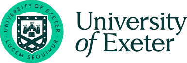
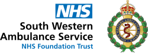

# ambmodels

Modelling ambulance services using discrete‑event simulation and forecasting to support better planning and decision making.

A collaboration between the University of Exeter, Peninsula Collaboration for Health Operational Research and Development (PenCHORD), and South Western Ambulance Service NHS Foundation Trust (SWASFT).

 

  
  

